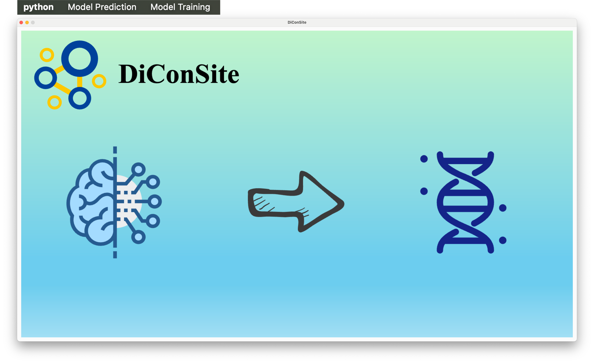
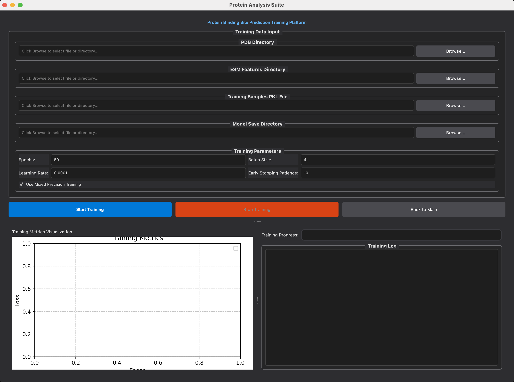
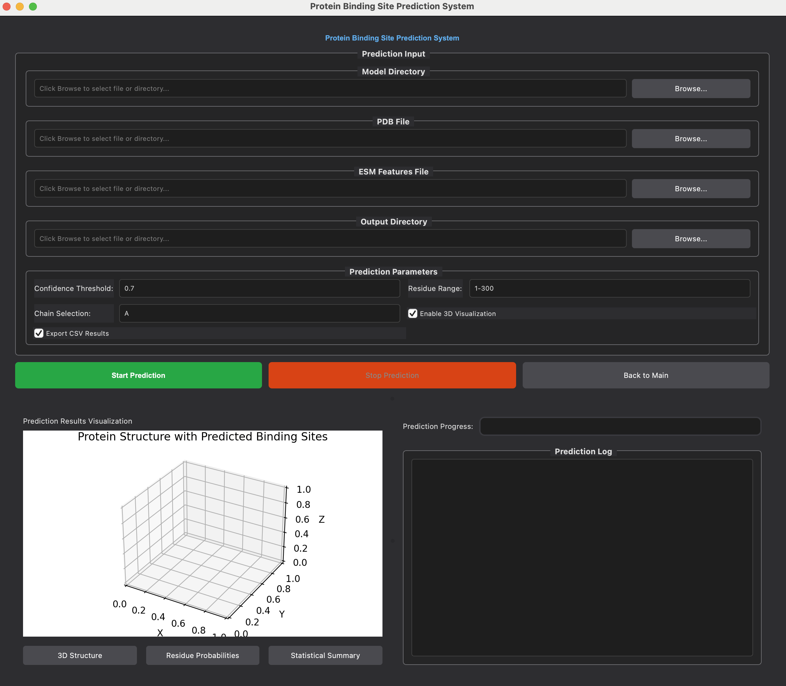

# DiConSite: A Unified Topology-Adaptive Architecture for Protein Binding Site Prediction Across Ligand Modalities

## 🚀 Introduction

Accurate identification of protein binding sites is essential for understanding biological mechanisms and advancing drug design. However, many structure-based predictors rely on static spatial graphs that are sensitive to structural noise and difficult to transfer across ligand modalities. To address this issue, we propose DiConSite, a topology-adaptive and reusable architecture for residue-level binding site prediction across ligand-specific tasks, including proteins, peptides, DNA, and RNA. DiConSite introduces a Latent Topological Evolution (LTE) module that augments the initial Euclidean graph with a latent functional topology, a Hierarchical Topological Distillation (HTD) objective that aligns relational structure across network depths, and a Dynamic Curriculum Distillation (DCD) schedule that stabilizes teacher guidance during early training. Extensive experiments across nine benchmarks show that DiConSite achieves consistently strong and often best-performing results, while improving robustness to structural uncertainty and cross-modal variation. By combining protein language model embeddings with topology-adaptive geometric reasoning, DiConSite provides a robust and generalizable framework for protein interaction analysis.

# Updates
- Aug, 2025: The train code released! 

## 📑 Results

### News
## Protein Interaction Sites Prediction Platform Homepage

## 🚀 How to use it?
### Dataset
Training data is available at the following link
https://drive.google.com/drive/folders/1zxgM0vDep1Hzb7M2kDsG-oAYjzvFEbyE?usp=drive_link

### Training model

The initial model interface is as follows, and you can enter the training page by clicking "Model Training" in the upper left corner.

We want to construct a unified model architecture that is suitable for multiple locus prediction, so we provide a simple training interface. 

The user needs to prepare the PDB structure file (predicted structure or real structure) of the protein in advance, the semantic features of each protein sequence obtained by ESM, the sample file (.pkl), and the file location where the model weights are saved. By clicking on "Start training", you can start running. The "Training log" records the training process.

