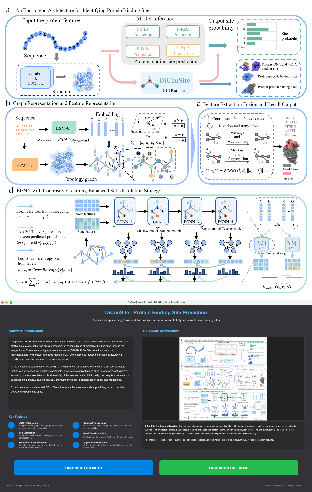

# DiConSite: A Unified Prediction Framework for Protein Binding Sites Based on EGNN and Contrastive Self-Distillation
The code will be released before June
## 🚀 Introduction

We propose DiConSite, a unified deep learning framework based on a contrastive learning-enhanced self-distillation strategy, achieving precise prediction of multiple types of molecular binding sites through the integration of E(n)-equivariant graph neural networks (EGNN). DiConSite combines semantic representations from protein language models (PLM) with geometric features of protein structures via EGNN, enabling effective structure-aware modeling. At the model architecture level, we design a function-driven contrastive learning self-distillation structure that, through latent space similarity constraints, encourages similar binding sites to form compact clusters, enhancing the representational discriminability of the teacher model. Additionally, the deep teacher network supervises the shallow student network, improving the model's generalization ability and robustness. Experimental results show that DiConSite outperforms the latest methods in predicting protein, peptide, DNA, and RNA binding sites. 

## 📑 Results

### News

## 🚀 How to use it?
### Dataset
Training data is available at the following link
https://drive.google.com/drive/folders/1zxgM0vDep1Hzb7M2kDsG-oAYjzvFEbyE?usp=drive_link

### Training model

The initial model interface is as follows, and you can enter the training page by clicking "Model Training" in the upper left corner.

We want to construct a unified model architecture that is suitable for multiple locus prediction, so we provide a simple training interface. 

The user needs to prepare the PDB structure file (predicted structure or real structure) of the protein in advance, the semantic features of each protein sequence obtained by ESM, the sample file (.pkl), and the file location where the model weights are saved. By clicking on "Start training", you can start running. The "Training log" records the training process.

